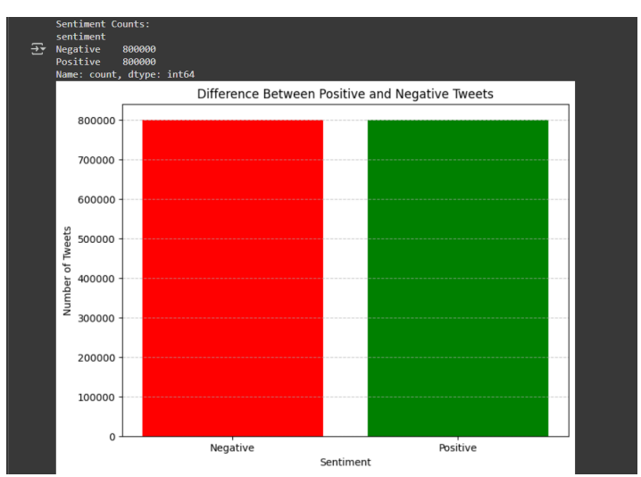
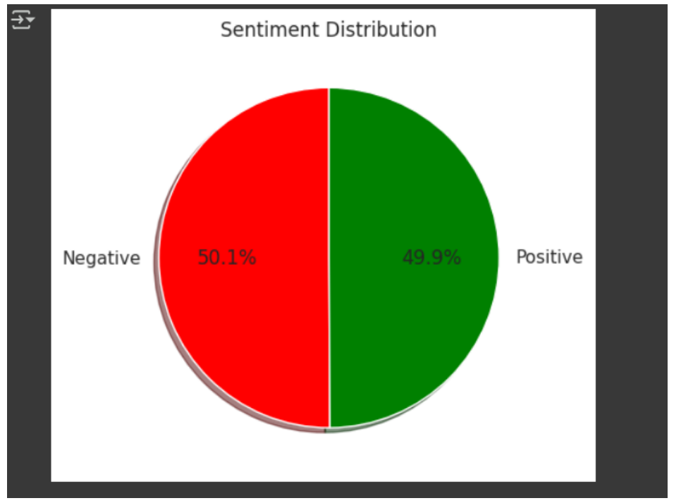

# Sentiment Analysis using Python

## Overview

This project performs sentiment analysis on Twitter data using natural language processing (NLP) techniques and machine learning.

## Objective

The objective of this project is to classify tweets as positive or negative based on their textual content.

## Methodology

* Preprocessed text using stemming and stopword removal
* Converted text into numerical features using TF-IDF
* Trained a Logistic Regression model for classification

## Features

* Text preprocessing
* TF-IDF vectorization
* Logistic Regression model
* Accuracy evaluation

## Tech Stack

* Python
* Pandas
* NumPy
* Scikit-learn
* NLTK
* Matplotlib / Seaborn

## Results

* Model Accuracy: ~79%

### Sentiment Distribution (Bar Chart)

### Sentiment Proportions (Pie Chart)

## Dataset

Twitter Sentiment140 Dataset:
https://www.kaggle.com/datasets/kazanova/sentiment140

## Documentation

Detailed project report:
[View Report](sentiment_analysis_report.pdf)

## Note

This project is designed to run on Google Colab.
Dataset is downloaded using Kaggle API inside the notebook.
